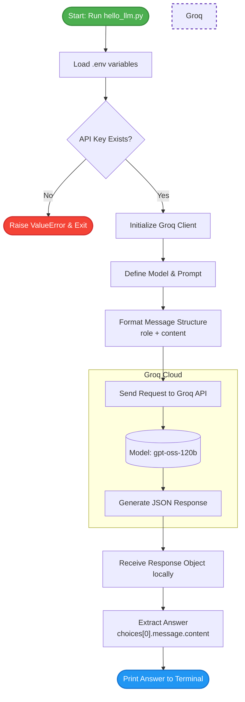

# Groq LLM API - First API Call Breakdown

This repository contains a beginner-friendly Python script that demonstrates how to connect to the Groq API, securely load an API key, and make a basic chat completion request using a Large Language Model (LLM).

## Prerequisites

Before running the script, ensure you have the following installed:
1. Python 3.x
2. Required packages:
   ```bash
   pip install groq python-dotenv
   ```
3. A `.env` file in the same directory containing your Groq API key:
```env
GROQ_API_KEY=your_actual_api_key_here

```


---

## 🧠 Code Breakdown & Explanation

Here is a step-by-step explanation of what every block of code in this script does.

### 1. Importing Required Libraries

```python
import os
from dotenv import load_dotenv
from groq import Groq

```

* **`os`**: A built-in Python library that lets us interact with the operating system (used here to grab environment variables).
* **`load_dotenv`**: A function from the `python-dotenv` library that reads a hidden `.env` file and loads its contents into the system environment.
* **`Groq`**: The official Python client library provided by Groq to interact with their API.

### 2. Loading and Securing the API Key

```python
# Loading variables from .env file
load_dotenv()

# Get API key from .env File for GROQ
my_api_key = os.getenv("GROQ_API_KEY")

# Error Message if API not found
if not my_api_key:
    raise ValueError("GROQ_API_KEY is missing")

```

* `load_dotenv()` finds your `.env` file and loads it silently.
* `os.getenv()` extracts the specific API key value.
* The `if not` block is a safety mechanism. If you forgot to create the `.env` file or misnamed the variable, the script will crash immediately with a clear error message instead of failing confusingly later on.

### 3. Initializing the Client and Model

```python
# Creating Groq client
client = Groq(api_key=my_api_key)

# Selecting model
model = "openai/gpt-oss-120b"

```

* **`client = Groq(...)`**: This creates the main connection object. It handles all the complex network requests to Groq's servers behind the scenes.
* **`model`**: Tells the API exactly which AI model we want to use to process our prompt.

### 4. Structuring the Prompt

```python
# Creating prompt and Role
role = "user"
prompt = "Give a short summary on types of machine learning"

# Defining the role and passing the prompt
message = [
        {
            "role": role,
            "content": prompt
        }
]

```

* LLM APIs require messages to be sent in a specific format: a **List of Dictionaries**.
* **`role`**: Defines *who* is speaking. The `"user"` role means this is a human asking a question.
* **`content`**: The actual text of the question or instruction.

### 5. Making the API Request

```python
# Sending request to LLM (Groq)
response = client.chat.completions.create(model=model, messages=message)

```

* This is where the magic happens. We call `chat.completions.create`, pass in our chosen model and formatted message, and wait. The script pauses here for a fraction of a second while the Groq servers generate the response.

### 6. Handling and Displaying the Response

```python
# Getting answers: Multiple generated choices
print(response)

# Choosing first generated response
print("-" * 20)
answer = response.choices[0].message.content
print(answer)
```
* **`print(response)`**: This prints the raw data object returned by the API. It includes metadata like token usage, IDs, and the generated text.
* **`response.choices[0].message.content`**: This is how we extract just the readable text from the raw object.
* **`choices`**: The API returns a list of generated answers (usually just one, unless requested otherwise).
* **`[0]`**: We select the first (and only) generated answer in that list.
* **`message.content`**: We drill down into the message payload to grab the exact text string the AI wrote.

## 🔄 High-Level Execution Flow

If you want to visualize how the data moves, here is the basic flow of the script:

1. **Authentication:** The script looks for `.env`, extracts the secret key, and logs into the Groq Client.
2. **Configuration:** The script packages your question ("What are the types of machine learning?") and instructions on which model to use.
3. **Transmission:** The packaged data is sent over the internet to Groq's API.
4. **Processing:** Groq's hardware runs the `gpt-oss-120b` model to generate an answer.
5. **Extraction:** The script receives a large data object back, drills down into `choices[0].message.content`, and prints only the readable answer to your terminal.
## 🔄 Visual Flow
Here is a visual representation of how the data moves through the script, from initialization to the final printed answer.

## How to Run?
1. Open your terminal.
2. Ensure your virtual environment is active.
3. Run the script:
```bash
python hello_llm.py
```
