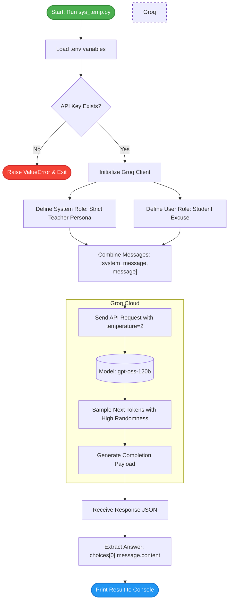

# Week 1, Day 2: System Prompts & Temperature Control

This guide breaks down how to guide an LLM's persona using **System Prompts** and how to control randomness and creativity using the **Temperature** parameter via the Groq API.
## 1. Core Concepts
### 1. The Role Architecture (`system` vs `user`)
Conversational LLMs accept a structured list of messages with distinct roles:
* **`system`**: Defines the model's identity, boundaries, tone, constraints, and instructions. It guides how the assistant should interpret and respond to subsequent messages.
* **`user`**: The human input, query, or prompt that the assistant needs to answer.
* **`messages = [system_message, message]`**: When bundled into a list, the model processes the system instruction first to establish the persona before evaluating the user prompt.
### 2. The `temperature` Parameter
Temperature controls the probability distribution when the model selects the next token.

| Temperature Value | Behavior | Predictability | Best Use Cases |
| :--- | :--- | :--- | :--- |
| **0.0 - 0.2** | Deterministic, focused, concise | Highest | Coding, math, classification, data extraction |
| **0.7 - 1.0** | Balanced, conversational | Medium | General chat, summarization, brainstorming |
| **1.5 - 2.0** | Creative, diverse, unpredictable | Lowest | Creative writing, poetry, wild ideation, roleplay |

> **Note:** A temperature of `2.0` represents maximum randomness. While it encourages highly creative responses, it also increases the risk of incoherent formatting or hallucinations.

## 2. The Code (`sys_temp.py`)

```python
import os
from dotenv import load_dotenv
from groq import Groq

# Loading variables from .env file
load_dotenv()

# Get API key from .env File for GROQ
my_api_key = os.getenv("GROQ_API_KEY")

# Error Message if API not found
if not my_api_key:
    raise ValueError("GROQ_API_KEY is missing")

# Creating Groq client
client = Groq(api_key=my_api_key)

# Selecting model
model = "openai/gpt-oss-120b"

# Creating prompt and Role
role = "user"
prompt = "I forgot to submit the assignment also I was not present on the assignment was given"

# System Message
system_message = {
    "role": "system",
    "content": "You are strict teacher who is famous for punishing students for misbehave"
}

# Defining the role and passing the prompt
message = {
    "role": role,
    "content": prompt
}

# Combining system and user messages
messages = [system_message, message]

# Sending request to LLM (Groq) with temperature set to 2
response = client.chat.completions.create(
    model=model,
    messages=messages,
    temperature=2
)

# Choosing first generated response
answer = response.choices[0].message.content
print(answer)

```

---

## 3. Code Breakdown & Step-by-Step Logic

### Step 1: Environment & Authentication

```python
load_dotenv()
my_api_key = os.getenv("GROQ_API_KEY")
if not my_api_key:
    raise ValueError("GROQ_API_KEY is missing")
client = Groq(api_key=my_api_key)

```

* Safely retrieves credentials from `.env` to prevent exposing API keys in source control.
* Validates that the key is present before initializing the client connection.

### Step 2: Persona Framing via System Message

```python
system_message = {
    "role": "system",
    "content": "You are strict teacher who is famous for punishing students for misbehave"
}

```

* Sets a strict, disciplinary teacher persona. The model will adhere to this framing when crafting its response.

### Step 3: Message Assembly

```python
messages = [system_message, message]

```

* Combines the system persona and the student's excuse into a sequential list that the model reads top-to-bottom.

### Step 4: Generation with High Temperature

```python
response = client.chat.completions.create(
    model=model,
    messages=messages,
    temperature=2
)

```

* Sets `temperature=2` to sample from a wider token probability distribution, resulting in a dramatic, expressive response from the "strict teacher."

### Step 5: Response Parsing

```python
answer = response.choices[0].message.content
print(answer)

```

* Traverses the response JSON tree: `response -> choices[0] -> message -> content`.

---

## 4. Execution Flowchart


