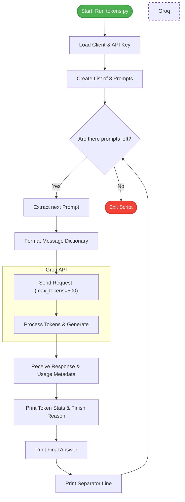

# Week 1, Day 3: Token Usage & Prompt Iteration
This document covers how to automate multiple LLM requests using Python loops, and how to extract and analyze API usage metadata like Token Counts and Finish Reasons. 

## 1. Core Concepts

### 1. Token Usage Analytics
Every API call returns a `usage` object that tracks exactly how much compute was consumed. This is crucial for managing costs and context windows:
* **`prompt_tokens`**: The number of tokens consumed by your input message and system instructions.
* **`completion_tokens`**: The number of tokens generated by the model in its response (including hidden reasoning tokens for advanced models).
* **`total_tokens`**: The sum of prompt and completion tokens. This is usually what you are billed for.

### 2. The `finish_reason`
The API tells you *why* the model stopped generating text. The two most common reasons are:
* **`stop`**: The model successfully finished its thought and generated a complete answer. 
* **`length`**: The model hit your `max_tokens` limit and was abruptly cut off before it could finish.

### 3. The `max_tokens` Trap with Reasoning Models
When using reasoning models like `openai/gpt-oss-120b`, the model generates a hidden "Chain of Thought" before outputting visible text. **These hidden thoughts count toward your `max_tokens` limit.** If you set `max_tokens` too low (e.g., 500), the model might consume all of them just "thinking" about a complex prompt, resulting in a completely blank output and a `finish_reason` of `length`.

## 2. The Code (`tokens.py`)

```python
import os
from dotenv import load_dotenv
from groq import Groq

# Loading the variable from .env file
load_dotenv()

# Getting API Key from .env file
my_api_key = os.getenv("GROQ_API_KEY")

# Error for missing API
if not my_api_key:
    raise ValueError("API Key is missing")

# Creating GROQ Client
client = Groq(api_key=my_api_key)

# Selecting model
model = "openai/gpt-oss-120b"

# Creating Prompts and role
role = "user"
prompt1 = "Hi!"
prompt2 = "Brief history of IIT Roorkee"
prompt3 = "Describe the Diwali festival in details"
prompts = [prompt1, prompt2, prompt3]

# Passing response to LLM through Iteration
for prompt in prompts:
    message = {
        "role": role,
        "content": prompt
    }
    messages = [message]
    
    # Sending request to LLM (Groq) with a token limit
    response = client.chat.completions.create(model=model, messages=messages, max_tokens=500)
    
    # Extracting token usage statistics
    usage = response.usage
    
    # Printing the analytics and the answer
    print(f"Prompt: {prompt} --> prompt_tokens: {usage.prompt_tokens} completion_tokens: {usage.completion_tokens} total_tokens: {usage.total_tokens} finish_reason: {response.choices[0].finish_reason}")
    print(response.choices[0].message.content)
    print("-" * 30)

```
## 3. Code Breakdown & Step-by-Step Logic

### Step 1: Organizing Multiple Inputs

```python
prompts = [prompt1, prompt2, prompt3]

```

* Instead of running the script three separate times, we store all our questions in a single Python list.

### Step 2: The Iteration Loop

```python
for prompt in prompts:
    message = {"role": role, "content": prompt}
    messages = [message]

```

* The `for` loop grabs one prompt at a time.
* It packages that specific prompt into the required `[{"role": "user", "content": "..."}]` dictionary format.

### Step 3: API Request with Hard Limits

```python
response = client.chat.completions.create(model=model, messages=messages, max_tokens=500)

```

* We introduce a new parameter: `max_tokens=500`. This acts as a safety brake, forcing the API to stop generating if it exceeds 500 completion tokens, which protects your API budget from runaway outputs.

### Step 4: Extracting Analytics

```python
usage = response.usage
print(f"... prompt_tokens: {usage.prompt_tokens} ... finish_reason: {response.choices[0].finish_reason}")

```
* **`response.usage`**: We pull the metadata block out of the API response.
* Using an f-string, we format the data to show exactly how much effort the model spent reading (`prompt_tokens`), thinking/writing (`completion_tokens`), and whether it finished naturally (`stop`) or hit the token limit (`length`).

## 4. Execution Flowchart

Here is a visual representation of how the `for` loop interacts with the API iteratively.


## 5. Quick Revision Q&A

**Q1. What is the difference between `prompt_tokens` and `completion_tokens`?**

`prompt_tokens` represent the size of your input (the question you asked and any system instructions). `completion_tokens` represent the size of the model's generated output (its answer).

**Q2. Why is the `finish_reason` important?**

It acts as a diagnostic tool. If an answer cuts off mid-sentence and the finish reason is `length`, you know you need to increase your `max_tokens` parameter. If it says `stop`, the model successfully completed its thought.

**Q3. Why did the model output blank text for a prompt when `max_tokens` was 500?**

Advanced reasoning models (like `gpt-oss-120b`) use invisible tokens to "think" before they write. If a prompt requires heavy logical planning, the model will consume all 500 tokens on internal reasoning, hitting the `length` limit before outputting any visible answer.

**Q4. How do you prevent a reasoning model from blanking out on complex queries?**

You must give it a significantly larger runway to process its thoughts by increasing the `max_tokens` parameter (e.g., `max_tokens=2000` or higher).