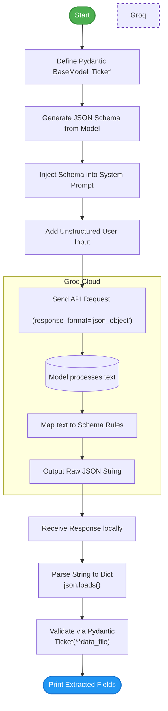

# Week 1, Day 4: Structured Data Extraction & JSON Mode
This document covers how to force a Large Language Model to return data in a strictly formatted JSON structure using the `response_format` parameter and the `pydantic` library. This is a critical skill for building AI agents that need to pass data to databases or traditional software functions.

## 1. Core Concepts

### 1. Structured Output (JSON Mode)
By default, LLMs return unstructured text (like a conversational paragraph). When integrating AI into software, we often need data in a predictable format (JSON) so our code can read it. Passing `response_format={"type": "json_object"}` forces the LLM to output a valid JSON string.

### 2. Pydantic & Data Validation
`pydantic` is a popular Python library used for data parsing and validation. 
* By creating a class that inherits from `BaseModel`, we define the exact "shape" or "schema" of the data we want (e.g., specific fields for name, email, etc., and their data types like `str` or `int`).
* Pydantic automatically generates a schema that the LLM can understand, and later verifies that the LLM's output matches those rules.

### 3. Serialization vs. Deserialization
* **Serialization (`Ticket.model_json_schema()`):** Converting our Python class into a JSON schema format to send to the API.
* **Deserialization (`json.loads()`):** Taking the raw text string returned by the LLM and converting it back into a usable Python dictionary.

## 2. The Code (`json_extraction.py`)
```python
import os
import json
from groq import Groq
from dotenv import load_dotenv
from pydantic import BaseModel

# Getting Variable from .env
load_dotenv()

# Loading Groq API Key
my_api_key = os.getenv("GROQ_API_KEY")
if not my_api_key:
    raise ValueError("API Missing")

# Creating Client and selecting model
client = Groq(api_key=my_api_key)
model = "openai/gpt-oss-120b"

# Structuring Output of LLM using Pydantic Library
class Ticket(BaseModel):
    name: str
    email: str
    issue: str
    customer_id: int

# Creating Schema to feed into the prompt
schema = Ticket.model_json_schema()

# Passing response type to force JSON output
response_format = {
    "type": "json_object"
}

# System prompt for getting desired output in defined schema
system_prompt = f"""
Extract personal information from the ticket strictly based on this schema and give a json output. {schema}
"""
message_system = {
    "role": "system",
    "content": system_prompt
}

# User input text and adding it into prompt
input_text = "Hello, Im Vivek, Yesterday I bought a iPhone which is not a working at all now. My address is Delhi. My email is abc@gmail.com.Contact no. 1234567890"

prompt = f"""
This is a customer ticket. Please extract personal information from this. Keep the information to the point, under issue only 1 word issue category: {input_text}
"""
message = {
    "role": "user",
    "content": prompt
}

# Creating Array of messages
messages = [message_system, message]

# Getting response from LLM
response = client.chat.completions.create(
    model=model,
    messages=messages,
    response_format=response_format
)

answer = response.choices[0].message.content
print("--- RAW JSON FROM LLM ---")
print(answer)
print("-" * 30)

# Reading Raw JSON file and loading into Python
raw_json = answer
data_file = json.loads(raw_json)

# Validating and converting to Pydantic object
ticket = Ticket(**data_file)

# Printing extracted details safely
print("--- PARSED PYTHON OBJECT ---")
print(f"Name: {ticket.name}")
print(f"Email: {ticket.email}")
print(f"Issue: {ticket.issue}")
print(f"Customer ID: {ticket.customer_id}")

```
## 3. Code Breakdown & Step-by-Step Logic

### Step 1: Defining the Data Shape

```python
class Ticket(BaseModel):
    name: str
    email: str
    issue: str
    customer_id: int

schema = Ticket.model_json_schema()

```

* We define the data fields we need. Pydantic guarantees that `customer_id` will be an integer and the others will be strings.
* `.model_json_schema()` automatically translates this Python class into a JSON blueprint that the LLM knows how to read.

### Step 2: Forcing JSON Output

```python
response_format = {"type": "json_object"}

```

* Passing this to the API call acts as a strict guardrail. The model will fail or retry on its end if it attempts to output conversational text instead of raw JSON.
* *Requirement:* You **must** also explicitly instruct the model to return JSON in the system prompt, which is why we included `"give a json output"`.

### Step 3: Extracting the Output

```python
raw_json = answer
data_file = json.loads(raw_json)

```

* The LLM returns a large string of text that just happens to be formatted like JSON.
* `json.loads()` converts that text string into an actual Python dictionary structure.

### Step 4: Instantiating the Pydantic Object

```python
ticket = Ticket(**data_file)

```

* The `**` operator unpacks the Python dictionary and passes the keys/values directly into the `Ticket` class.
* Pydantic checks the data. If the LLM returned a string for `customer_id` instead of an int, Pydantic would throw a validation error here.

## 4. Execution Flowchart


