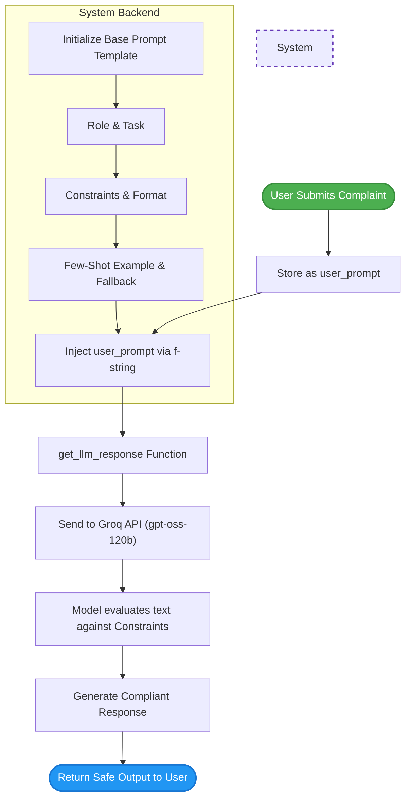

# Week 2, Day 6: Prompt Engineering Frameworks


This document covers how to transition from writing basic instructions to crafting **Production-Grade Prompts**. By using a structured framework, we can strictly control an LLM's persona, output format, and safety boundaries—preventing it from giving dangerous advice or breaking character during critical customer interactions.

## 1. Core Concepts: The 6-Pillar Prompt Framework

When building AI agents for the real world, simply asking the LLM to "reply to the user" is not enough. This script demonstrates a highly structured prompting technique using six distinct sections:

1. **Role:** Defines the AI's persona (e.g., *empathetic professional* vs. *robotic cheerleader*).
2. **Task:** The core objective the LLM must achieve.
3. **Constraints:** The strict boundaries the AI must never cross (e.g., *never give medical/legal advice, do not exceed 100 words*).
4. **Output Format:** The exact sequence or structure the answer must follow (e.g., *Apology -> Action -> Request Info*).
5. **Example (Few-Shot Prompting):** Providing a perfect mock conversation. LLMs are exceptional pattern matchers; showing them one good example drastically improves accuracy.
6. **Fallback:** A safety net instruction for edge cases or abusive language, ensuring the bot gracefully hands off to a human instead of hallucinating.

## 2. The Code (`prompt_eng.py`)

*(Note: Minor spelling typos from the draft have been corrected for clean execution and a professional portfolio presence).*

```python
import os
from groq import Groq
from dotenv import load_dotenv
from pathlib import Path

# Getting variables from .env
load_dotenv()

# Loading API 
my_api_key = os.getenv("GROQ_API_KEY")
if not my_api_key:
    raise ValueError("API Not Found")

# Creating client
client = Groq(api_key=my_api_key)
model = "openai/gpt-oss-120b"

def get_llm_response(prompt):
    message = {
        "role": "user",
        "content": prompt
    }
    messages = [message]
    response = client.chat.completions.create(model=model, messages=messages)
    ans = response.choices[0].message.content
    return ans

# Simulating a user complaint
user_prompt = "I found insects in my food"

# Advanced Prompt Engineering Framework
pre_engineered_prompt = f"""
# Role
You're a highly professional, empathetic, and responsive customer support agent for a food company.

# Task
When a customer reports a severe food safety issue (e.g., "I found insects in my food"), 
you must immediately apologize, take the claim seriously, request necessary documentation 
(order number, photos), and offer an immediate resolution (refund or new meal as compensation) while 
initiating an escalation to the human trust and safety team.

# Constraints
1. Never offer them medical or legal advice.
2. Never use a robotic, cheerful tone.
3. Do not exceed your response over 100 words.
4. Do not offer them anything other than a refund or meal replacement.

# Output Format
1. Sincere apology by acknowledging the severity of the issue immediately.
2. Clearly tell them what you're doing to fix this right now.
3. Politely ask for an order number if not given.
4. Assure them responsible authorities have been informed.

# Example
User: "I just found a dead bug in my salad, this is disgusting!"
Bot: "I am so incredibly sorry to hear this. This is completely 
unacceptable and falls far below our food safety standards. 
I am processing a full refund for your order immediately. 
So that I can escalate this directly to our restaurant manager 
and quality assurance team, could you please provide your order 
number and a photo of the item? Again, I sincerely apologize for 
this distressing experience."

# Fallback
If the user's message is unclear, if they become overly abusive, or 
if you cannot process the refund automatically:
Immediately stop the automated flow and output exactly: "I am so sorry for this experience. 
Because of the severity of this issue, I am transferring you directly to a 
human supervisor right now who will resolve this for you immediately. Please hold for just a moment."

This is the user complaint:
{user_prompt}
"""

print(get_llm_response(pre_engineered_prompt))
```
## 3. Code Breakdown & Step-by-Step Logic

### Step 1: The Reusable Function

```python
def get_llm_response(prompt):
    # ... handles the API request ...

```

Instead of writing the Groq API call every time, we wrap it in a clean `get_llm_response()` function. This abstracts the complexity and allows us to easily test multiple prompts by just calling the function.

### Step 2: F-String Injection

```python
pre_engineered_prompt = f""" ... {user_prompt} """

```

By using an `f-string`, we act as a "middleman." The user doesn't see our massive list of rules; they just type "I found insects in my food." Our script dynamically injects their complaint into the bottom of our heavily engineered prompt before sending it to the LLM.

### Step 3: Guardrails

The most critical part of this script is the `# Constraints` block. Without it, an LLM might try to be overly helpful by diagnosing potential food poisoning (violating medical advice rules) or offering lifetime free meals (costing the company money).

## 4. Execution Flowchart


