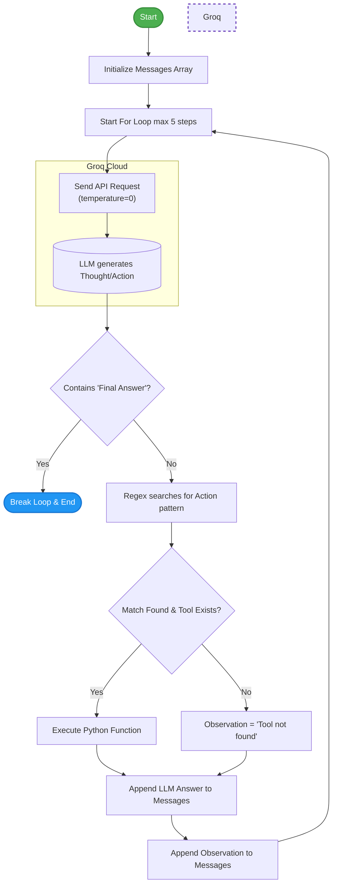

# Week 2, Day 7: ReAct Agent Loop

This document covers how to build an autonomous AI agent from scratch using the **ReAct (Reason + Act)** framework. Instead of relying on heavy frameworks like LangChain, we use pure Python, strict prompt engineering, and Regular Expressions (Regex) to parse the LLM's output and execute local Python functions. This teaches the fundamental mechanics of how AI agents "think" and interact with the outside world.

## 1. Core Concepts

### 1. The ReAct Framework (Reason + Act)

By default, LLMs predict the next word to answer a question immediately. The ReAct pattern forces the LLM into a loop where it must first output a `Thought`, then decide on an `Action` (a tool to use), wait for an `Observation` (the result of the tool), and repeat until it has enough information to provide a `Final Answer`.

### 2. Text Parsing & Regex Control

Because we are building this without native JSON tool calling, we rely entirely on strict prompt engineering. We command the LLM to format its tool requests exactly like `Action: tool_name(argument)`. We then use Python's `re` (Regex) module to scan the generated text, extract the tool name, and extract the arguments so our Python script can run them.

### 3. State Management & The Loop

An agent is essentially just a `while` or `for` loop wrapped around an LLM API call. The most critical part of this loop is memory. When a Python tool finishes executing, we must manually append both the LLM's last thought AND the tool's result (the observation) back into the `messages` array. Without this step, the LLM forgets what it just did.

## 2. The Code (`react_agent.py`)

```python
import os
import re
from time import sleep
from pathlib import Path
from groq import Groq
from dotenv import load_dotenv

load_dotenv()

# Initialize Groq client
my_api_key = os.getenv("GROQ_API_KEY")
client = Groq(api_key=my_api_key)
model = "openai/gpt-oss-120b"

# Mock database for product prices
def get_product_price(product):
    if product == "iPhone 17":
        return 150000
    elif product == "iPhone 15":
        return 80000
    else:
        return 0

# Basic calculator (note: eval() is unsafe for production)
def calculator(expression):
    try:
        return eval(expression)
    except:
        return "Cal error"

# Map string names to the actual Python functions
tools = {
    "get_product_price": get_product_price,
    "calculator": calculator
}

# Strict instructions so the LLM formats its output exactly as needed for our Regex
system_prompt = """
You are a shopping assistant.
You have these tools:
calculator(expression)
get_product_price(product)

Important:
Call tools exactly like this:
Action: get_product_price("iPhone 17")
Action: calculator("56266-32632")

Never write:
get_product_price(product="iPhone 17")
calculator(expression="7555-6662")

Follow these rules:
1. Decide what you need to do next
2. Call only One tool at a time
3. After writing an Action, stop immediately
4. Wait until receive an observation
5. Then decide your next action
6. When task is complete, give Final Answer 

Format:
Thought: What you need to do
Action: tool_name(argument)

Final Answer: your answer
"""

def run_agent(question):
    # Initialize conversation history
    messages = [
        {"role": "system", "content": system_prompt},
        {"role": "user", "content": question}
    ]
    
    # Cap at 5 iterations to prevent infinite loops and runaway API costs
    for step in range(5):
        print("\n--------------------------")
        print(f"STEP: {step+1}")
        print("--------------------------")
        
        # Temperature 0 keeps the logic predictable for tool usage
        response = client.chat.completions.create(model=model, messages=messages, temperature=0)
        answer = response.choices[0].message.content
        print(answer)

        # Stop if the agent solved it
        if "Final Answer" in answer:
            break
            
        # Parse the Action and arguments out of the LLM's response
        match = re.search(
            r"Action:\s*(\w+)\((.*?)\)",
            answer
        )
        
        if match:
            tool_name = match.group(1)
            tool_input = match.group(2)
            
            # Clean up rogue spaces or quotes the LLM might add
            tool_input = tool_input.strip().strip('"')

            # Execute the tool if it exists in our dictionary
            if tool_name in tools:
                tool = tools[tool_name]
                observation = tool(tool_input)
            else:
                observation = "Tool not found"
                
            print("Observation:", observation)

            # Update memory so the LLM remembers what it just did...
            messages.append({
                "role": "assistant",
                "content": answer
            })

            # ...and feed the result back for the next iteration
            messages.append({
                "role": "user",
                "content": "Observation: " + str(observation)
            })
            
            sleep(5)

prompt = """
I have 200000 rupees. what is price of an iPhone 15 and?
and how much money  will I have left?
"""

run_agent(prompt)

```

## 3. Code Breakdown & Step-by-Step Logic

### Step 1: Mapping Tools

```python
tools = {
    "get_product_price": get_product_price,
    "calculator": calculator
}

```

* We create a dictionary to act as a bridge. It connects the literal string name that the LLM generates (e.g., `"calculator"`) to the actual Python function `calculator()` loaded in our script's memory.

### Step 2: Extracting the Action via Regex

```python
match = re.search(r"Action:\s*(\w+)\((.*?)\)", answer)

```

* `\s*` handles any accidental spaces the LLM might put after the colon.
* `(\w+)` captures the tool name (e.g., `get_product_price`) into `match.group(1)`.
* `(.*?)` captures whatever is inside the parentheses (the arguments) into `match.group(2)`.

### Step 3: Executing the Tool

```python
if tool_name in tools:
    tool = tools[tool_name]
    observation = tool(tool_input)

```

* We check if the LLM hallucinated a tool. If the tool exists in our dictionary, we grab the function reference and execute it by passing in the clean `tool_input`.

### Step 4: Updating Context (Memory)

```python
messages.append({"role": "assistant", "content": answer})
messages.append({"role": "user", "content": "Observation: " + str(observation)})

```

* **Crucial Step:** We must save the LLM's own thought process back into the history, followed immediately by a fake "user" message providing the observation data. When the loop restarts, the LLM reads this and knows exactly where it left off.

## 4. Execution Flowchart

