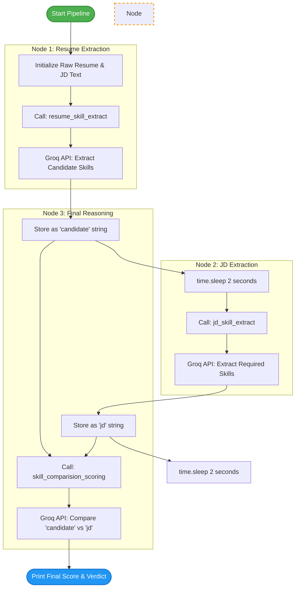

# Week 2, Day 8: Prompt Chaining Architecture


This document covers how to implement **Prompt Chaining** to handle complex reasoning tasks. Instead of overloading a single LLM call with a massive context and multiple instructions, we chain together modular, single-purpose LLM calls. The output of the extraction prompts serves directly as the input for the final evaluation prompt, resulting in higher accuracy and fewer hallucinations.

## 1. Core Concepts

### 1. Modular Extraction (Divide and Conquer)

When an LLM is asked to read a long resume, read a long job description, extract skills from both, and calculate a score all at once, it suffers from "context overload." By dividing this into distinct steps—first extracting the resume skills, then extracting the JD skills—we force the LLM to focus purely on data retrieval before attempting any complex reasoning.

### 2. Sequential Execution (The Chain)

Prompt chaining relies on a sequential flow of data. The final step (the comparison and scoring) cannot occur until the prerequisite steps (the skill extractions) are complete. We capture the text outputs from the first two LLM calls and dynamically inject them into the final prompt using Python `f-strings`.

### 3. API Rate Limit Management

Because prompt chaining requires firing multiple API requests in rapid succession for a single user action, managing the API's rate limit becomes critical. Introducing deliberate pauses using `time.sleep()` ensures the script does not trigger an `HTTP 429: Too Many Requests` error from the Groq API.

## 2. The Code (`prompt_chaining.py`)

```python
import os 
from groq import Groq
from dotenv import load_dotenv
from time import sleep

load_dotenv()

# Groq Client
my_api_key=os.getenv("GROQ_API_KEY")
client=Groq(api_key=my_api_key)
model="openai/gpt-oss-120b"

JD="""
    About the job
Data Science InternCompany: Nexal IITLocation: RemoteDuration: Up to 6 monthsStipend: Up to ₹10,000 Performance BasedBatch Start Date:20th SeptemberAbout the ProgramAt Nexal IIT, we're doing things differently. This isn't a traditional job or a standard internship—it’s an open collaboration program designed for aspiring Data Scientists to gain hands-on, real-world experience. If you are self-taught, a boot-camp graduate, a student, or transitioning careers, this is a space for you to work with real datasets, solve practical problems, build data-driven projects, and learn by doing alongside our team.What You’ll Do
Collect & Analyze Data: Work with structured and unstructured datasets to identify meaningful patterns, trends, and insights.
Clean & Prepare Data: Process, clean, and organize datasets to prepare them for analysis and model development.
Build Data Science Projects: Work on practical projects involving data analysis, predictive modeling, and real-world problem-solving.
Develop Machine Learning Models: Learn to build, train, test, and evaluate basic machine learning models using relevant tools and techniques.
Visualize Data & Insights: Create meaningful visualizations and reports to communicate findings clearly and effectively.
Collaborate on Projects: Use industry-relevant tools and work with team members while receiving feedback and guidance from mentors.
Who You Are
Passionate about Data Science and eager to learn (no specific technical or computer science degree required).
Basic understanding of data analysis, statistics, or programming concepts.
Familiar with Python or interested in learning Python for data analysis and Data Science.
Basic knowledge of mathematics, statistics, or machine learning concepts is an advantage.
Bonus Points: If you have hands-on experience with Python, Pandas, NumPy, Matplotlib, Scikit-learn, SQL, Jupyter Notebook, or data visualization tools.
Curious, analytical, driven, and comfortable asking questions.
What You Get
Remote & Flexible: Contribute from anywhere, on a schedule that works for you.
Real Portfolio Projects: Work on practical datasets, data analysis projects, machine learning models, and data-driven solutions that can strengthen your portfolio.
Direct Mentorship: Get valuable feedback, guidance, and support from our mentors and team members.
Hands-On Experience: Gain practical exposure to industry-relevant Data Science tools, workflows, and real-world problem-solving.
Proof of Impact: A certificate of completion and a strong letter of recommendation for active contributors.
Application Deadline: 17th September. Fill the form and join our WhatsApp community for the joining process.    
"""

Resume="""
VIVEK
LinkedIn | GitHub | LeetCode
Area of Interest: Machine Learning, Deep Learning, Predictive Modeling, Data Structures & Algorithms 
EDUCATION
Degree/Examination Institution/Board Year CGPA/
%
M.Tech in Data Science (I Year I
Sem) Indian Institute of Technology Roorkee 2028
B.Tech in Biotechnology Sardar Vallabhbhai Patel University of Agriculture and
Technology, Meerut 2026 8.250
Intermediate (Class XII) Alpine Public School, Khurja (CBSE Board) 2021 92.00%
Matriculate (Class X) D.S. Memorial Oxford Public School, Shikarpur (CBSE Board) 2019 82.16%
SKILLS
Programming & Scripting: Python, Linux/WSL, AWS CLI
Data & AI Frameworks: NumPy, Pandas, Matplotlib, Seaborn, Scikit Learn, Plotly, LangChain, ChromaDB,
Ollama
Tools & Pipelines: Streamlit, Snakemake, Groq API, Pydantic, Conda, uv
Bioinformatics & Domain: Fastp, Megahit, Kraken2, MAFFT, FastTree, WGS, 16S rRNA, Immunoassays, Cell
Culture
EXPERIENCE
Topic: Effect of LDI-2000 Irradiation on Gut Microbiota of C57BL/6 Mice
Analyzed 16S rRNA metagenomic data to quantify radiation-induced gut microbiome shifts and taxonomic
population dynamics in murine models.
Executed comprehensive wet-lab workflows encompassing bacterial phenotypic characterization, bacteriophage
isolation, and kinetic assays to evaluate complex phage-host interactions.
PROJECTS
Engineered an automated bioinformatics pipeline using Snakemake to process WGS and 16S rRNA sequencing
data, integrating Fastp, Megahit, Kraken2, MAFFT, and FastTree.
Developed a local RAG AI assistant leveraging ChromaDB, LangChain, and Ollama (Llama 3.2, Nomic-Embed
Text) for semantic querying of taxonomic profiling and quality control metrics.
Built an interactive frontend using Streamlit, rendering dynamic relative abundance visualizations and phylogeny
mapping with Plotly, Pandas, and NumPy.
Research Internship | INMAS DRDO, New Delhi February 2026 - May 2026
Microbiome Analytics Platform with RAG Assistant | Self Project June 2026 - Present
Configured high-concurrency AWS CLI fetching to source memory-intensive Kraken databases and
containerized the workflow using Conda in a Linux/WSL environment.
AI-Powered Resume Analyzer & Scorer | Self Project
2026
Developed an automated, LLM-driven recruitment tool using Python and the Groq API (openai/gpt-oss-120b) to
extract structured data from Job Descriptions and candidate resumes.
Engineered a dual-prompting scoring system to evaluate candidate skills, calculate a 0-100% match score, and
generate ranked outputs with detailed AI verdicts.
Enforced structured JSON data extraction using Pydantic schemas to eliminate LLM hallucinations.
LICENSES & CERTIFICATIONS
Monitoring in Google Cloud Skill Badge – Google (Issued Aug 2026)
Analyze Sentiment with Natural Language API Skill Badge – Google (Issued Aug 2026)
Immunology – NPTEL, IIT Kharagpur (Issued Oct 2024) | Credential ID: NPTEL24BT63S655600650
Bioreactors – NPTEL, IIT Madras (Issued Aug 2024) | Credential ID: NPTEL24BT39S141600077
Human Molecular Genetics – NPTEL, IIT Kanpur (Issued Apr 2023) | Credential ID: NPTEL23BT10S45160686
POSITIONS OF RESPONSIBILITY & EXTRA CURRICULARS
NSS Volunteer | SVPUA&T, Meerut 
August 2022 - July 2024
Dedicated National Service Scheme (NSS) Volunteer at SVPUA&T Meerut with 240 hours of formal community
service.
Actively engaged in organizing social welfare initiatives and participated in special intensive camps focused on
rural outreach and local development.
"""

def ask_llm(system_prompt,user_prompt):
    sys_msg={
        "role":"system",
        "content":system_prompt
    }
    user_msg={
        "role":"user",
        "content":user_prompt
    }
    messages=[sys_msg,user_msg]
    respone=client.chat.completions.create(model=model,messages=messages)
    answer=respone.choices[0].message.content
    return answer

def resume_skill_extract(Resume):
    system_prompt="""
    You are a professional HR assistant. Extract the skills from the candidates resume provided.
    Only return the skills no other information. Do not invent any skills by yourself. 
    Output format: All skills should be arrange in line through comma seperation
    """
    user_prompt=f"""
    Extract the skills from this resume
    {Resume}
    """
    return ask_llm(system_prompt,user_prompt)

def jd_skill_extract(JD):
    system_prompt="""
    You are a professional HR assistant. Extract the skills from the Job description  provided.
    Only return the skills no other information. Do not invent any skills by yourself.
    Output format: All skills should be arrange in line through comma seperation
    """
    user_prompt=f"""
    Extract the skills from this JD {JD}
    """
    return ask_llm(system_prompt,user_prompt)

def skill_comparision_scoring(candidate,jd):
    system_prompt="""
    You are a professional HR assistant. compare the skills of candidate and the skills required in the JD and produce a final score between
    1 and 100. also produce a short verdict whther the candidate is a good fit for the role.
    """
    user_prompt=f"""
    Compare and matc h the skills Resume: {candidate} and JD {jd}
    """
    return ask_llm(system_prompt,user_prompt)

candidate=resume_skill_extract(Resume)
print(f"Candidate skills:{candidate}")
sleep(2)
jd=jd_skill_extract(JD)
print(f"JD Skills Requirements: {jd}")
sleep(2)
score=skill_comparision_scoring(candidate,jd)
print("="*500)
print(f"Final Verdict:{score}")

```

## 3. Code Breakdown & Step-by-Step Logic

### Step 1: The Universal LLM Caller

```python
def ask_llm(system_prompt, user_prompt):

```

* Following the DRY (Don't Repeat Yourself) principle, we abstract the actual Groq API call into a single, reusable function. This function handles the boilerplate formatting of the `messages` array, taking any dynamically generated system and user prompt strings.

### Step 2: Targeted Extraction Functions

```python
candidate = resume_skill_extract(Resume)
jd = jd_skill_extract(JD)

```

* These functions isolate the data retrieval process. By strictly defining the output format in the system prompt (`All skills should be arrange in line through comma seperation`), we guarantee that the LLM strips away paragraphs of fluff and returns only dense, actionable data.

### Step 3: The Reasoning Prompt

```python
score = skill_comparision_scoring(candidate, jd)

```

* This is the final node in the chain. Instead of feeding it the raw `Resume` and `JD` text blocks, we inject the clean, comma-separated lists generated by the previous steps. The LLM now has a perfectly clear context window to perform its comparison and generate the verdict.

## 4. Execution Flowchart


