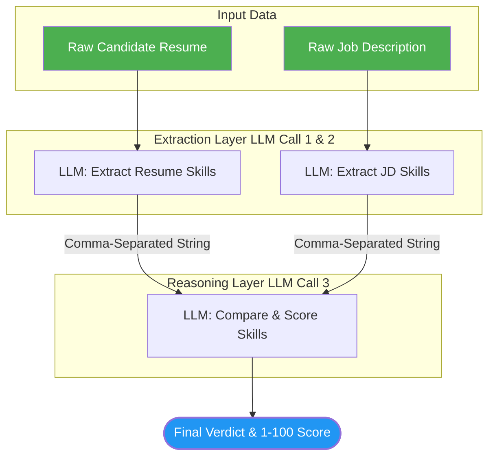

# 🚀 Week 2, Day 8: Prompt Chaining Architecture


This project demonstrates the concept of **Prompt Chaining**—a powerful AI engineering technique where a complex task is broken down into sequential LLM API calls. The output of one prompt serves directly as the input for the next, resulting in higher accuracy, reduced hallucinations, and better reasoning.

## ✨ Core Concept: Why Chain Prompts?

If you ask an LLM to read a raw 2-page resume and a 1-page job description and instantly score them, it suffers from "context overload" and often misses critical details. 

**The Chaining Solution:**
1. **Node 1:** Read the Resume -> Extract *only* the skills.
2. **Node 2:** Read the Job Description -> Extract *only* the required skills.
3. **Node 3:** Compare Output 1 and Output 2 -> Generate a final match score and verdict.

By forcing the model to focus on one micro-task at a time, the final evaluation is highly accurate and strictly data-driven.

## 🔄 System Architecture

Here is the visual flow of the prompt chain:


## 🛠️ Code Implementation Highlights

### 1. Modular AI Functions

Instead of writing a massive block of code, the system is divided into modular Python functions. Each function wraps its own specific `system` and `user` prompt.

```python
def resume_skill_extract(Resume):
    # Specialized prompt for resume parsing
    return ask_llm(system_prompt, user_prompt)

def jd_skill_extract(JD):
    # Specialized prompt for JD parsing
    return ask_llm(system_prompt, user_prompt)

def skill_comparision_scoring(candidate, jd):
    # Final reasoning prompt that ingests the outputs above
    return ask_llm(system_prompt, user_prompt)

```

### 2. API Rate Limit Management

Since prompt chaining fires multiple API calls in rapid succession, the script implements `time.sleep(2)` between executions to respect the Groq API rate limits and prevent `HTTP 429: Too Many Requests` errors.

---

## 💻 Setup & Execution

### 1. Environment Setup

```bash
uv venv --python 3.11
# Activate the virtual environment
uv add groq python-dotenv

```

### 2. Configure API Keys

Create a `.env` file in the root directory:

```env
GROQ_API_KEY=your_groq_api_key_here

```

### 3. Run the Chain

```bash
python prompt_chaining.py

```

### Expected Output

The script will output the results step-by-step as it moves through the chain:

```text
Candidate skills: Python, Linux/WSL, AWS CLI, NumPy, Pandas, Matplotlib...
JD Skills Requirements: Python, Pandas, NumPy, Matplotlib, Scikit-learn, SQL...
================================================================================
Final Verdict: The candidate is an excellent fit. Match Score: 85/100.

```
